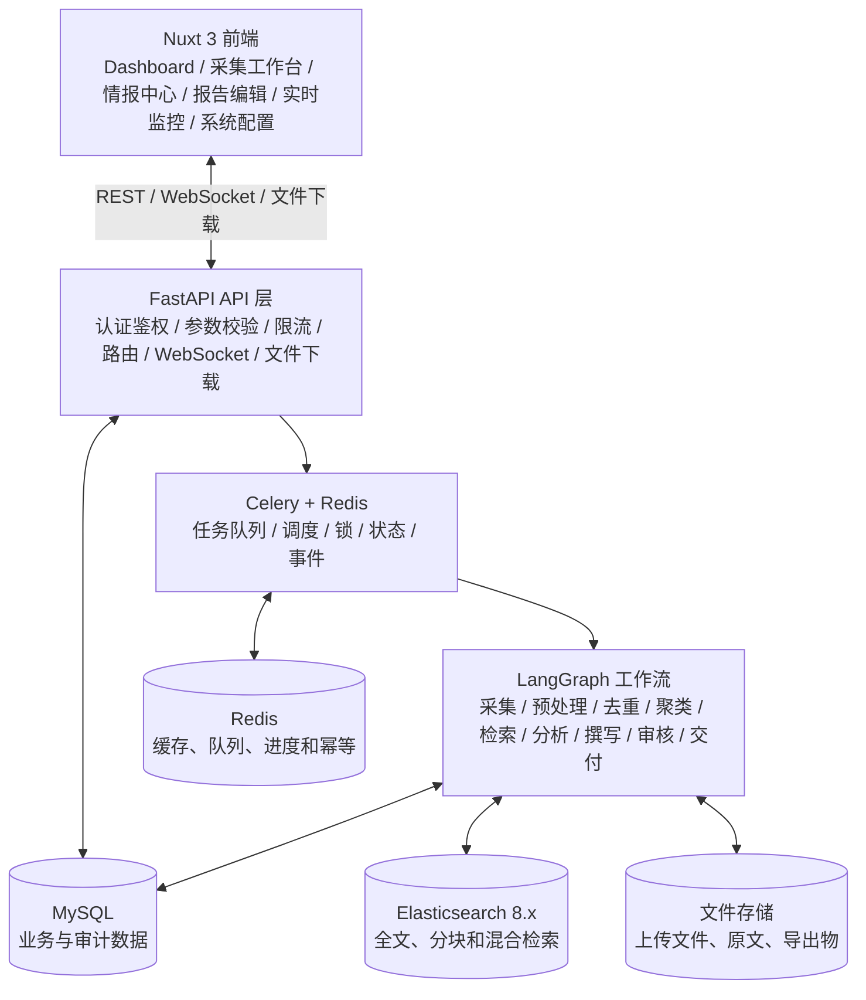
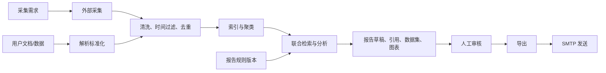

# 系统架构

## 1. 总体架构



## 2. 分层职责

### 前端展示层

- 只负责交互、展示、客户端校验和状态订阅。
- 服务端数据通过统一 API 客户端访问。
- 任务进度通过 WebSocket 接收，断线后通过 REST 查询最终状态。
- 富文本和模型输出必须经过安全渲染，不直接执行 HTML 或脚本。

### API 层

- 负责认证、授权、输入验证、分页、幂等和错误规范。
- 创建长任务后立即返回任务标识，不在 HTTP 请求内执行完整工作流。
- 文件上传先校验大小、类型和内容，再写入存储并创建解析任务。
- 不保存业务流程状态机；工作流状态由 LangGraph 和任务记录共同维护。

### 任务与工作流层

- Celery 负责任务分发、定时调度、并发和重试。
- LangGraph 负责 Agent 节点编排、条件分支、返工和检查点恢复。
- 每个节点均有明确输入输出 Schema，禁止通过无结构文本隐式传递关键状态。
- 外部调用必须设置超时、重试上限、速率限制和成本预算。

### 数据与存储层

- MySQL：用户、工作空间、需求、配置、任务、报告、版本、引用、图表和审计。
- Elasticsearch：文档正文、分块、关键词、向量、聚类和检索字段。
- Redis：Celery Broker/Backend、分布式锁、短期进度、缓存和幂等键。
- 文件存储：原始上传、网页快照、附件、报告导出和图表图片。

## 3. 可扩展接口

```text
Collector            采集 RSS、API、网页或浏览器页面
ContentParser        解析网页、PDF、DOCX、表格等内容
EmbeddingProvider    生成向量
LLMProvider          生成、分析和审核
WorkflowNode         扩展 LangGraph 节点
StorageProvider      本地磁盘、MinIO 或 S3
DeliveryChannel      SMTP、企微、钉钉或飞书
Exporter             DOCX、PDF、Markdown
```

每个接口由注册表按类型加载。配置中保存实现标识和参数，不保存 Python 类路径，避免内部代码结构泄漏成公共契约。

## 4. 关键数据流



## 5. 可靠性设计

- 任务状态持久化，不以 WebSocket 连接是否存在作为成功依据。
- 每个任务和交付操作使用幂等键。
- 节点输出先持久化再推进下一节点。
- 登录凭据失效时暂停对应数据源，不进行无限重试。
- Elasticsearch 不作为唯一事实存储；业务状态和原始文件引用保存在 MySQL。
- Redis 数据丢失后可依据 MySQL 任务记录恢复或重新排队。

