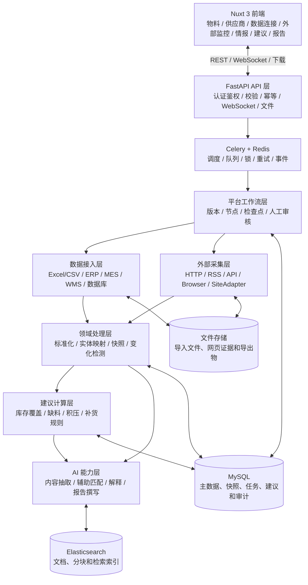
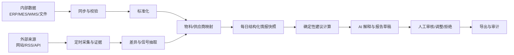

# 系统架构

## 1. 总体架构


```mermaid
flowchart TB
    UI["Nuxt 3 前端\n物料 / 供应商 / 数据连接 / 外部监控 / 情报 / 建议 / 报告"]
    API["FastAPI API 层\n认证鉴权 / 校验 / 幂等 / WebSocket / 文件"]
    QUEUE["Celery + Redis\n调度 / 队列 / 锁 / 重试 / 事件"]
    CONNECT["数据接入层\nExcel/CSV / ERP / MES / WMS / 数据库"]
    COLLECT["外部采集层\nHTTP / RSS / API / Browser / SiteAdapter"]
    DOMAIN["领域处理层\n标准化 / 实体映射 / 快照 / 变化检测"]
    PLAN["建议计算层\n库存覆盖 / 缺料 / 积压 / 补货规则"]
    AI["AI 能力层\n内容抽取 / 辅助匹配 / 解释 / 报告撰写"]
    WORKFLOW["平台工作流层\n版本 / 节点 / 检查点 / 人工审核"]
    MYSQL[("MySQL\n主数据、快照、任务、建议和审计")]
    ES[("Elasticsearch\n文档、分块和检索索引")]
    FILES[("文件存储\n导入文件、网页证据和导出物")]

    UI <-->|"REST / WebSocket / 下载"| API
    API --> QUEUE
    QUEUE --> WORKFLOW
    WORKFLOW --> CONNECT
    WORKFLOW --> COLLECT
    CONNECT --> DOMAIN
    COLLECT --> DOMAIN
    DOMAIN --> PLAN
    DOMAIN --> AI
    PLAN --> AI
    WORKFLOW <--> MYSQL
    DOMAIN <--> MYSQL
    PLAN <--> MYSQL
    AI <--> ES
    COLLECT <--> FILES
    CONNECT <--> FILES
```

## 2. 分层职责

### 前端展示层

- 展示物料、供应商、内外部数据状态、变化信号、建议、报告和任务进度。
- 服务端数据通过统一 API 客户端访问，客户端不自行推导正式采购数量。
- WebSocket 只传递进度事件；断线后通过游标重连或 REST 查询最终状态。
- 模型输出、网页快照和富文本经过安全渲染，不直接执行 HTML 或脚本。

### API 层

- 负责认证、授权、输入验证、分页、幂等和错误规范。
- 创建同步、采集、计算或报告任务后立即返回任务标识，不在 HTTP 请求内运行长流程。
- 文件上传先校验大小、类型和内容，再写入隔离存储并创建导入任务。
- 所有查询按 `workspaceId` 隔离；前端不能提交或覆盖服务端推导的工作空间标识。

### 内部数据接入层

- 首版支持 Excel/CSV 导入，后续通过 `EnterpriseDataConnector` 接入 ERP、MES、WMS 和数据库。
- 连接器只负责读取、游标推进和字段映射，不在连接器内计算业务建议。
- 每次同步固化原始引用、字段映射版本、业务时间、内容摘要和校验结果。
- 首版连接器默认只读；任何写回能力都必须单独审批、授权和审计。

### 外部采集层

- `Collector` 负责 HTTP、RSS、API 或浏览器获取，`SiteAdapter` 描述站点特有导航和抽取策略。
- `CrawlPolicy` 限制允许域名、页面数、深度、并发、延迟、脚本执行、附件和超时。
- 每次成功采集保存原始证据、页面元数据和内容摘要，再执行页面差异与信号抽取。
- 浏览器能力用于授权登录、动态渲染和人工调试，不用于绕过验证码、付费墙或访问控制。

### 领域处理与建议计算层

- 标准化内部数据单位、业务时间和字段语义，把外部信号映射到 `Material` 或 `Supplier`。
- 低置信度、冲突或一对多实体映射进入人工确认，不直接影响正式建议。
- 每日情报快照固定内部快照集合、外部信号集合、建议集合和内容摘要。
- `PlanningEngine` 使用版本化确定性规则或统计模型计算库存覆盖、缺料、积压、补货日期和数量。
- 相同输入快照、参数和算法版本必须产生相同结果；AI 不能替代确定性计算。

### AI 与工作流层

- AI 用于网页内容抽取、实体候选匹配、异常解释、摘要和报告撰写。
- 工作流节点以结构化 Schema 交换状态，不通过自然语言隐藏关键数值或业务状态。
- 平台工作流引擎负责节点编排、条件分支、预算、检查点和人工等待；LangGraph、Temporal、Prefect 或自研执行器仅作为适配器。
- Celery 负责定时调度、任务分发、并发和重试，不能成为业务状态的唯一事实来源。

### 数据与存储层

- MySQL：用户、连接配置、物料、供应商、快照、信号、建议、任务、报告和审计。
- Elasticsearch：网页和文档正文、分块、关键词、向量与检索字段，不保存唯一业务事实。
- Redis：Celery Broker/Backend、分布式锁、短期进度、缓存和幂等键。
- 文件存储：导入原文件、网页证据、截图、附件、报告导出和图表图片。

## 3. 可扩展接口

```text
EnterpriseDataConnector  读取 ERP、MES、WMS、数据库或文件数据
FieldMappingProvider      将来源字段映射为平台标准 Schema
Collector                 获取 RSS、API、静态网页或浏览器页面
BrowserRuntimeProvider    启动或连接 Playwright、远程 CDP 或浏览器 Profile
SiteAdapter               描述站点入口、登录态、分页、选择器和抽取策略
CrawlPolicy               限制域名、页数、深度、并发、超时和附件
ContentParser             解析网页、PDF、DOCX 和表格
MaterialEntityResolver    生成并确认物料、供应商匹配候选
SignalExtractor           抽取价格、规格、可用性、交期和供应商事件
PlanningEngine            计算库存覆盖、风险、采购日期和数量
RecommendationPolicy      定义建议阈值、原因码和人工审核规则
LLMProvider               内容抽取、解释、摘要和报告撰写
WorkflowEngine            启动、恢复、取消和查询工作流运行
WorkflowNode              定义平台节点输入输出、预算和审计契约
StorageProvider           本地磁盘、MinIO 或 S3
Exporter                  DOCX、PDF 或 Markdown
DeliveryChannel           SMTP、企微、钉钉或飞书
```

接口由注册表按实现标识加载。公共配置不保存 Python 类路径，避免内部代码结构泄漏成 API 或数据库契约。

## 4. 关键数据流


```mermaid
flowchart LR
    ERP["内部数据\nERP/MES/WMS/文件"] --> SYNC["同步与校验"]
    WEB["外部来源\n网站/RSS/API"] --> FETCH["定时采集与证据"]
    SYNC --> NORMALIZE["标准化"]
    FETCH --> SIGNAL["差异与信号抽取"]
    NORMALIZE --> RESOLVE["物料/供应商映射"]
    SIGNAL --> RESOLVE
    RESOLVE --> SNAPSHOT["每日结构化情报快照"]
    SNAPSHOT --> RULES["确定性建议计算"]
    RULES --> EXPLAIN["AI 解释与报告草稿"]
    EXPLAIN --> HUMAN["人工审核/调整/拒绝"]
    HUMAN --> EXPORT["导出与审计"]
```

内部同步和外部采集是独立的定时生产流程。日报读取当日已固化数据；周报和月报只读取覆盖日期内的日报结构化快照，不能在报告请求中临时启动浏览器或内部同步。

## 5. 可靠性设计

- 每个同步批次、采集页面、每日快照、建议计算和报告任务都使用幂等键。
- 节点输出先持久化再推进下一节点，任务状态不依赖 WebSocket 连接。
- 连接器游标和页面采集游标分别管理，失败后从最后成功检查点恢复。
- 登录凭据失效或出现访问挑战时暂停对应来源，不无限重试。
- 建议永久绑定输入快照、参数和算法版本，历史结果不随规则更新而变化。
- MySQL 保存重建 Elasticsearch 索引所需的文档元数据和文件引用。
- Redis 数据丢失后可依据 MySQL 的任务、运行和检查点记录重新排队。
