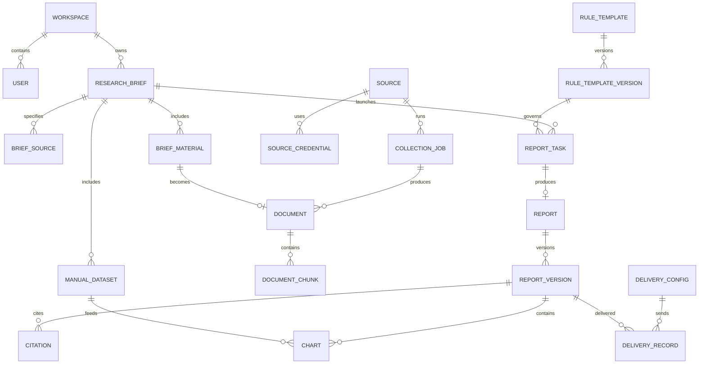

# 数据模型

## 1. 实体关系概览

## 2. 核心实体

### 用户与空间

| 实体 | 关键字段 |
| --- | --- |
| `Workspace` | id, name, timezone, status |
| `User` | id, workspaceId, email, passwordHash, role, status, lastLoginAt |

### 采集需求工作台

| 实体 | 关键字段 |
| --- | --- |
| `ResearchBrief` | title, objective, requiredQuestions, dateRangeKind, collectionStart/End, analysisStart/End, timezone, status |
| `BriefSource` | briefId, sourceType, url, domain, keywords, excludeTerms, priority, instructions |
| `BriefMaterial` | briefId, materialType, storageKey/text/url, sourceName, occurredAt, purpose, credibility |
| `ManualDataset` | briefId, name, schemaJson, rowsStorageKey, unitRules, sourceNote, occurredAt |
| `AnalysisConstraint` | briefId, metricRules, exclusions, assumptions, outputRequirements |

### 采集与知识库

| 实体 | 关键字段 |
| --- | --- |
| `Source` | type, name, baseUrl, allowedDomains, schedule, parserConfig, retentionDays, status |
| `SourceCredential` | sourceId, credentialType, encryptedPayload, expiresAt, status |
| `BrowserProfile` | sourceId, providerType, externalProfileId, encryptedConfig, proxyRef, status |
| `SiteAdapter` | sourceId, version, entryUrls, selectorsJson, actionsJson, crawlPolicyId, status |
| `CrawlPolicy` | name, maxPages, maxDepth, concurrency, requestDelayMs, timeoutSeconds, allowScripts, allowAttachments |
| `AccessGrant` | sourceId, grantType, grantedTo, purpose, licenseNote, validFrom/To, confirmedBy/At, status |
| `AccessChallenge` | sourceId, jobId, challengeType, url, statusCode, screenshotRef, domDigest, status |
| `ManualVerificationSession` | challengeId, browserProfileId, openedBy, expiresAt, result, auditRef |
| `CollectionJob` | sourceId/briefId, windowStart/End, cursor, status, attempt, metrics, errorCode |
| `Document` | originType, sourceId/materialId, canonicalUrl, title, author, publishedAt, fetchedAt, contentHash, rawStorageKey, status |
| `DocumentChunk` | documentId, sequence, text, tokenCount, embeddingRef, metadata |

`originType` 必须区分：

- `WEB`
- `RSS`
- `API`
- `USER_DOCUMENT`
- `USER_TEXT`
- `USER_DATASET`

### 模板、报告和图表

| 实体 | 关键字段 |
| --- | --- |
| `RuleTemplate` | name, reportType, status, activeVersionId |
| `RuleTemplateVersion` | version, sourceFiles, structureJson, styleJson, citationRules, chartRules, publishedAt |
| `ReportTask` | briefId, templateVersionId, scheduleType, idempotencyKey, status, currentNode, budget |
| `Report` | taskId, title, periodStart/End, status, currentVersionId, approvedBy/At |
| `ReportVersion` | reportId, version, contentJson, markdown, changeSource, createdBy |
| `Citation` | reportVersionId, sectionId, claimId, documentId/chunkId, quoteDigest, relevanceScore |
| `Chart` | reportVersionId, datasetId, title, type, datasetSnapshot, optionJson, sourceRefs |

### 交付、工作流和审计

| 实体 | 关键字段 |
| --- | --- |
| `DeliveryConfig` | type, name, encryptedConfig, sender, status |
| `DeliveryRecord` | configId, reportVersionId, recipients, subject, attachmentRefs, idempotencyKey, status, attempts |
| `WorkflowDefinition` | key, version, engineType, definitionJson, limits, status |
| `AgentDefinition` | key, provider, model, promptVersion, toolPolicy, limits |
| `WorkflowRun` | taskId, workflowVersion, engineType, engineRunRef, status, stateRef, startedAt, finishedAt |
| `WorkflowNodeRun` | runId, nodeKey, inputDigest, outputRef, status, tokens, durationMs, errorCode |
| `AuditLog` | actorId, action, resourceType, resourceId, result, metadata, createdAt |

## 3. 状态约定

### ResearchBrief

`DRAFT → READY → ARCHIVED`

`ResearchBrief` 是需求配置，不承载任务执行状态。运行中的状态由 `ReportTask` 表达；一个 Brief 可以多次启动任务。

### ReportTask

`PENDING → QUEUED → RUNNING → WAITING_HUMAN → SUCCEEDED`

失败状态为 `FAILED_RETRYABLE` 或 `FAILED_FINAL`；取消为 `CANCELLED`。

`WAITING_HUMAN` 表示自动生成已经完成但需要人工处理，例如自动审核超过返工上限、需要补充来源或等待编辑审核。

### Report

`DRAFT → IN_REVIEW → APPROVED → PUBLISHED → ARCHIVED`

`Report` 状态由人工审核与发布动作驱动，不表示后台任务是否仍在运行。报告发布后不得修改已发布版本，只能创建新版本。

### DeliveryRecord

`PENDING → SENDING → SENT`

失败为 `FAILED_RETRYABLE` 或 `FAILED_FINAL`。

## 4. 数据约束与索引

### 唯一约束

- `User(workspaceId, email)` 唯一。
- `ResearchBrief(workspaceId, title, deletedAt)` 在未删除记录中唯一。
- `RuleTemplateVersion(templateId, version)` 唯一。
- `ReportVersion(reportId, version)` 唯一。
- `Document(canonicalUrl)` 在 URL 存在时唯一；同一正文通过 `contentHash` 去重。
- `DeliveryRecord(idempotencyKey)` 唯一，防止重试重复发送。
- `ReportTask(idempotencyKey)` 唯一，防止重复启动同一任务。
- `SiteAdapter(sourceId, version)` 唯一，任务运行时固定适配器版本。
- `BrowserProfile(sourceId, providerType, externalProfileId)` 唯一。
- `AccessGrant(sourceId, grantType, validFrom, validTo)` 防止同一来源重复配置冲突授权。
- `ManualVerificationSession(challengeId)` 同一挑战同一时间只允许一个接管会话。

### 关键索引

- `ReportTask(status, createdAt)` 用于队列和监控。
- `WorkflowNodeRun(runId, nodeKey, status)` 用于恢复和节点追踪。
- `Document(publishedAt, originType, status)` 用于时间窗口过滤。
- `Citation(reportVersionId, sectionId, claimId)` 用于报告编辑器溯源。
- `AuditLog(workspaceId, actorId, createdAt)` 用于审计查询。
- `DeliveryRecord(status, createdAt)` 用于发送重试和监控。
- `CollectionJob(sourceId, status, createdAt)` 用于采集队列和失败恢复。
- `SiteAdapter(sourceId, status)` 用于选择当前可用适配器。
- `AccessChallenge(sourceId, status, createdAt)` 用于挑战处理队列。
- `AccessGrant(sourceId, status, validTo)` 用于判断付费或授权来源是否可采集。

### 外键与删除

- 所有业务实体必须带 `workspaceId` 或可通过父实体唯一追溯到 `workspaceId`。
- 删除用户、模板、报告和数据源默认软删除；已被报告引用的实体不得物理删除。
- `ReportVersion`、`RuleTemplateVersion`、`WorkflowDefinition`、`AgentDefinition` 一旦被任务引用，只能停用，不能修改历史内容。
- 原始文件可按保留策略清理，但已发布报告引用的文件摘要、来源元数据和导出物必须保留。
- Elasticsearch 索引记录可重建；MySQL 中必须保存重建所需的文档、分块和文件引用。

### 引用与图表最小字段

`Citation` 至少保存：

- `claimId`
- `sectionId`
- `documentId`
- `chunkId`
- `quoteDigest`
- `supportType`：`DIRECT`、`INDIRECT`、`CONFLICTING`
- `relevanceScore`

`Chart` 至少保存：

- `datasetSnapshot`
- `unit`
- `metricDefinition`
- `sourceRefs`
- `optionJson`
- `renderedImageRef`
- `createdFromClaimIds`

## 5. 时间与删除规则

- 所有数据库时间以 UTC 保存，API 返回 ISO 8601，并附带工作空间时区。
- 日期范围在创建任务时解析成固定的 UTC 起止时间，避免后续跨时区漂移。
- 业务实体默认软删除，原始文件根据保留策略异步清理。
- 已发布报告引用的模板版本、数据集快照和来源摘要不得物理删除。
