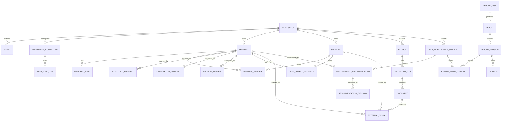

# 数据模型

## 1. 实体关系概览

```mermaid
erDiagram
    WORKSPACE ||--o{ USER : contains
    WORKSPACE ||--o{ ENTERPRISE_CONNECTION : configures
    ENTERPRISE_CONNECTION ||--o{ DATA_SYNC_JOB : runs
    WORKSPACE ||--o{ MATERIAL : owns
    WORKSPACE ||--o{ SUPPLIER : owns
    MATERIAL ||--o{ MATERIAL_ALIAS : has
    SUPPLIER ||--o{ SUPPLIER_MATERIAL : offers
    MATERIAL ||--o{ SUPPLIER_MATERIAL : sourced_by
    MATERIAL ||--o{ INVENTORY_SNAPSHOT : stocked_as
    MATERIAL ||--o{ CONSUMPTION_SNAPSHOT : consumed_as
    MATERIAL ||--o{ MATERIAL_DEMAND : demanded_as
    MATERIAL ||--o{ OPEN_SUPPLY_SNAPSHOT : supplied_as
    SUPPLIER ||--o{ OPEN_SUPPLY_SNAPSHOT : fulfills
    WORKSPACE ||--o{ SOURCE : monitors
    SOURCE ||--o{ COLLECTION_JOB : runs
    COLLECTION_JOB ||--o{ DOCUMENT : produces
    DOCUMENT ||--o{ EXTERNAL_SIGNAL : evidences
    MATERIAL ||--o{ EXTERNAL_SIGNAL : affected_by
    SUPPLIER ||--o{ EXTERNAL_SIGNAL : affected_by
    WORKSPACE ||--o{ DAILY_INTELLIGENCE_SNAPSHOT : records
    DAILY_INTELLIGENCE_SNAPSHOT ||--o{ PROCUREMENT_RECOMMENDATION : produces
    MATERIAL ||--o{ PROCUREMENT_RECOMMENDATION : recommends_for
    PROCUREMENT_RECOMMENDATION ||--o{ RECOMMENDATION_DECISION : reviewed_by
    DAILY_INTELLIGENCE_SNAPSHOT ||--o{ REPORT_INPUT_SNAPSHOT : feeds
    REPORT_TASK ||--o| REPORT : produces
    REPORT ||--o{ REPORT_VERSION : versions
    REPORT_VERSION ||--o{ REPORT_INPUT_SNAPSHOT : records
    REPORT_VERSION ||--o{ CITATION : cites
```

## 2. 核心实体

### 用户与空间

| 实体 | 关键字段 |
| --- | --- |
| `Workspace` | id, name, timezone, status |
| `User` | id, workspaceId, email, passwordHash, role, status, lastLoginAt |

### 企业数据连接与同步

| 实体 | 关键字段 |
| --- | --- |
| `EnterpriseConnection` | workspaceId, name, systemType, adapterKey, configRef, syncMode, schedule, status, lastSucceededAt |
| `FieldMappingVersion` | connectionId, entityType, version, mappingJson, unitRulesJson, status, publishedAt |
| `DataSyncJob` | connectionId, mappingVersionId, windowStart/End, cursorBefore/After, idempotencyKey, status, rowCountsJson, errorCode |
| `ImportFile` | syncJobId, originalName, mediaType, sizeBytes, storageKey, contentDigest, scanStatus, validationReportRef |

`systemType` 取值为 `ERP`、`MES`、`WMS`、`DATABASE`、`FILE` 或 `OTHER`。首版 `syncMode` 仅允许 `READ_ONLY`；后续写回必须使用独立接口与授权，不复用读取凭据。

### 物料与供应商主数据

| 实体 | 关键字段 |
| --- | --- |
| `Material` | workspaceId, externalCode, name, specification, category, baseUnit, safetyStockQty, leadTimeDays, status |
| `MaterialAlias` | materialId, aliasType, aliasValue, normalizedValue, sourceRef, status |
| `Supplier` | workspaceId, externalCode, name, website, country, status |
| `SupplierMaterial` | supplierId, materialId, supplierMaterialCode, purchaseUnit, conversionToBase, currency, minOrderQty, orderMultiple, leadTimeDays, status |
| `EntityMappingCandidate` | workspaceId, entityType, sourceRef, candidateEntityId, confidence, reasonJson, status, reviewedBy/At |

`EntityMappingCandidate.status` 取值为 `PENDING`、`CONFIRMED`、`REJECTED` 或 `SUPERSEDED`。只有 `CONFIRMED` 的映射可以进入正式每日快照和建议计算。

### 内部经营数据快照

| 实体 | 关键字段 |
| --- | --- |
| `InventorySnapshot` | workspaceId, materialId, locationCode, snapshotAt, onHandQty, availableQty, reservedQty, qualityHoldQty, unit, syncJobId, sourceRecordRef |
| `ConsumptionSnapshot` | workspaceId, materialId, bucketDate, actualQty, plannedQty, unit, syncJobId, sourceRecordRef |
| `MaterialDemand` | workspaceId, materialId, requiredAt, requiredQty, unit, sourceType, syncJobId, sourceRecordRef |
| `OpenSupplySnapshot` | workspaceId, materialId, supplierId, orderNo, orderLineNo, orderedQty, receivedQty, openQty, unit, expectedAt, status, syncJobId, sourceRecordRef |
| `PlanningParameterVersion` | workspaceId, materialId, version, serviceLevel, safetyStockRule, demandHorizonDays, leadTimeDays, roundingRule, status, publishedAt |

所有数量同时保存原始单位和换算后的基础单位值。无法完成单位换算的记录进入导入错误队列，不参与正式计算。

### 外部采集与变化信号

| 实体 | 关键字段 |
| --- | --- |
| `Source` | workspaceId, type, name, baseUrl, allowedDomains, schedule, parserConfig, retentionDays, status |
| `SourceCredential` | sourceId, credentialType, encryptedPayload, expiresAt, status |
| `BrowserProfile` | sourceId, providerType, externalProfileId, encryptedConfig, proxyRef, status |
| `SiteAdapter` | sourceId, version, entryUrls, selectorsJson, actionsJson, crawlPolicyId, status |
| `CrawlPolicy` | workspaceId, name, maxPages, maxDepth, concurrency, requestDelayMs, timeoutSeconds, allowScripts, allowAttachments |
| `AccessGrant` | sourceId, grantType, purpose, licenseNote, validFrom/To, confirmedBy/At, status |
| `AccessChallenge` | sourceId, jobId, challengeType, url, statusCode, screenshotRef, domDigest, status |
| `ManualVerificationSession` | challengeId, browserProfileId, openedBy, expiresAt, result, auditRef |
| `CollectionJob` | sourceId, windowStart/End, cursorBefore/After, idempotencyKey, status, attempt, metricsJson, errorCode |
| `Document` | workspaceId, originType, sourceId, canonicalUrl, title, publishedAt, fetchedAt, contentDigest, rawStorageKey, status |
| `DocumentChunk` | documentId, sequence, text, tokenCount, embeddingRef, metadataJson |
| `ExternalSignal` | workspaceId, documentId, sourceId, signalType, materialId, supplierId, bindingKey, occurredAt, observedAt, previousValueJson, currentValueJson, unit, currency, confidence, evidenceRef, reviewStatus, contentDigest |

`signalType` 取值为 `PRICE`、`SPECIFICATION`、`AVAILABILITY`、`LEAD_TIME` 或 `SUPPLIER_EVENT`。`ExternalSignal` 必须至少绑定 `materialId` 或 `supplierId` 之一；`bindingKey` 使用非空稳定值（例如 `MATERIAL:{id}` 或 `SUPPLIER:{id}`）支持去重。正式信号必须有 `documentId`、证据引用和内容摘要。

`originType` 取值为 `WEB`、`RSS`、`API`、`USER_DOCUMENT`、`USER_TEXT` 或 `USER_DATASET`。

### 每日情报与采购建议

| 实体 | 关键字段 |
| --- | --- |
| `DailyIntelligenceSnapshot` | workspaceId, coveredDate, version, supersedesSnapshotId, timezone, internalSnapshotSetRef, externalSignalSetRef, recommendationSetRef, contentDigest, status, approvedBy/At |
| `ProcurementRecommendation` | workspaceId, dailySnapshotId, materialId, supplierId, asOfDate, horizonEnd, recommendedOrderDate, latestOrderDate, recommendedQty, unit, riskLevel, reasonCodesJson, calculationJson, explanation, inputDigest, algorithmKey, algorithmVersion, status |
| `RecommendationDecision` | recommendationId, decision, adjustedOrderDate, adjustedQty, reason, actorId, createdAt |

每日快照先以 `DRAFT` 固定内部快照、外部信号和参数版本，完成建议计算后写入 `recommendationSetRef` 与最终摘要并进入 `READY`。若补数或修正，创建递增版本并通过 `supersedesSnapshotId` 关联旧版本。

`ProcurementRecommendation.status` 为 `PROPOSED`、`APPROVED`、`ADJUSTED`、`REJECTED` 或 `EXPORTED`。状态由人工动作驱动；规则计算任务的成功或失败由 `WorkflowRun` 表达。

`RecommendationDecision.decision` 为 `APPROVE`、`ADJUST` 或 `REJECT`。调整不会覆盖原始建议，而是追加决策记录。

### 自定义分析、模板和报告

| 实体 | 关键字段 |
| --- | --- |
| `ResearchBrief` | workspaceId, title, objective, requiredQuestions, analysisStart/End, timezone, status |
| `BriefSource` | briefId, sourceType, url, keywords, excludeTerms, priority, instructions |
| `BriefAttachment` | briefId, attachmentType, storageKey/text/url, sourceName, occurredAt, purpose, credibility |
| `ManualDataset` | briefId, name, schemaJson, rowsStorageKey, unitRules, sourceNote, occurredAt |
| `RuleTemplate` | workspaceId, name, reportType, status, activeVersionId |
| `RuleTemplateVersion` | templateId, version, sourceFiles, structureJson, styleJson, citationRules, chartRules, publishedAt |
| `ReportTask` | workspaceId, briefId, templateVersionId, reportPeriod, inputMode, periodStart/End, idempotencyKey, status, currentNode, budget |
| `Report` | taskId, title, reportPeriod, periodStart/End, status, currentVersionId, approvedBy/At |
| `ReportVersion` | reportId, version, contentJson, markdown, htmlSnapshotRef, changeSource, createdBy |
| `ReportInputSnapshot` | reportVersionId, dailySnapshotId, sourceReportVersionId, coveredDate, structuredDataRef, htmlSnapshotRef, contentDigest |
| `Citation` | reportVersionId, sectionId, claimId, documentId, chunkId, internalSnapshotRef, quoteDigest, supportType, relevanceScore |
| `Chart` | reportVersionId, title, type, datasetSnapshot, unit, metricDefinition, optionJson, sourceRefs, renderedImageRef |

`ResearchBrief` 是补充的专题分析配置，不承载主数据、同步或任务状态。HTML 快照只用于展示和审计；`structuredDataRef` 是周报、月报计算的输入。

### 工作流、交付和审计

| 实体 | 关键字段 |
| --- | --- |
| `WorkflowDefinition` | key, version, engineType, definitionJson, limits, status |
| `AgentDefinition` | key, provider, model, promptVersion, toolPolicy, limits |
| `WorkflowRun` | workspaceId, taskType, taskId, workflowVersion, engineType, engineRunRef, status, stateRef, startedAt, finishedAt |
| `WorkflowNodeRun` | runId, nodeKey, inputDigest, outputRef, status, tokens, durationMs, errorCode |
| `DeliveryConfig` | workspaceId, type, name, encryptedConfig, sender, status |
| `DeliveryRecord` | configId, reportVersionId, recipients, subject, attachmentRefs, idempotencyKey, status, attempts |
| `AuditLog` | workspaceId, actorId, action, resourceType, resourceId, result, metadataJson, createdAt |

## 3. 状态边界

- `DataSyncJob`、`CollectionJob`、`ReportTask` 和 `WorkflowRun` 表达机器执行状态：`PENDING → QUEUED → RUNNING → SUCCEEDED`，失败为 `FAILED_RETRYABLE` 或 `FAILED_FINAL`，取消为 `CANCELLED`。
- 需要人工解决映射、访问挑战、缺失日报或报告审核时，任务进入 `WAITING_HUMAN`，不能把人工状态伪装成机器仍在运行。
- `DailyIntelligenceSnapshot` 为 `DRAFT → READY → APPROVED → ARCHIVED`，固化后只能创建新版本或替代快照，不能原地修改。
- `Report` 为 `DRAFT → IN_REVIEW → APPROVED → PUBLISHED → ARCHIVED`，由人工审核和发布驱动。
- `ReportTask.inputMode` 为 `COLLECT_AND_ANALYZE` 或 `AGGREGATE_DAILY_SNAPSHOTS`。周报和月报默认且只能使用后者，除非用户另行创建独立补采任务。
- `DeliveryRecord` 为 `PENDING → SENDING → SENT`，失败为 `FAILED_RETRYABLE` 或 `FAILED_FINAL`。

## 4. 数据约束与索引

### 唯一约束

- `User(workspaceId, email)` 唯一。
- `EnterpriseConnection(workspaceId, name)` 在未删除记录中唯一。
- `FieldMappingVersion(connectionId, entityType, version)` 唯一。
- `DataSyncJob(idempotencyKey)`、`CollectionJob(idempotencyKey)`、`ReportTask(idempotencyKey)` 唯一。
- `Material(workspaceId, externalCode)`、`Supplier(workspaceId, externalCode)` 唯一。
- `MaterialAlias(materialId, normalizedValue)` 唯一。
- `SupplierMaterial(supplierId, materialId)` 唯一。
- `InventorySnapshot(materialId, locationCode, snapshotAt, syncJobId)` 唯一。
- `ConsumptionSnapshot(materialId, bucketDate, syncJobId)` 唯一。
- `OpenSupplySnapshot(orderNo, orderLineNo, syncJobId)` 唯一。
- `Source(workspaceId, baseUrl)`、`SiteAdapter(sourceId, version)` 唯一。
- `Document(sourceId, canonicalUrl, contentDigest)` 唯一。
- `ExternalSignal(sourceId, signalType, bindingKey, occurredAt, contentDigest)` 唯一。
- `DailyIntelligenceSnapshot(workspaceId, coveredDate, version)` 唯一，`(workspaceId, coveredDate, contentDigest)` 也唯一以防同内容重复建版本。
- `ProcurementRecommendation(dailySnapshotId, materialId, algorithmKey, algorithmVersion)` 唯一。
- `RecommendationDecision(recommendationId, createdAt, actorId)` 唯一。
- `RuleTemplateVersion(templateId, version)`、`ReportVersion(reportId, version)` 唯一。
- `ReportInputSnapshot(reportVersionId, dailySnapshotId)` 唯一。
- `DeliveryRecord(idempotencyKey)` 唯一。

### 关键索引

- `DataSyncJob(connectionId, status, createdAt)` 与 `CollectionJob(sourceId, status, createdAt)` 用于调度和恢复。
- `Material(workspaceId, name, specification)` 与 `MaterialAlias(normalizedValue)` 用于实体匹配。
- `InventorySnapshot(materialId, snapshotAt)`、`ConsumptionSnapshot(materialId, bucketDate)` 和 `OpenSupplySnapshot(materialId, expectedAt, status)` 用于建议计算。
- `ExternalSignal(materialId, signalType, occurredAt)`、`ExternalSignal(supplierId, occurredAt)` 用于变化时间线。
- `DailyIntelligenceSnapshot(workspaceId, coveredDate, status)` 用于周期报告覆盖检查。
- `ProcurementRecommendation(workspaceId, status, riskLevel, asOfDate)` 用于建议工作台。
- `WorkflowNodeRun(runId, nodeKey, status)` 用于恢复和节点追踪。
- `Citation(reportVersionId, sectionId, claimId)` 用于报告证据溯源。
- `AuditLog(workspaceId, actorId, createdAt)` 用于审计查询。

### 外键、版本与删除

- 所有业务实体必须带 `workspaceId` 或通过父实体唯一追溯到工作空间。
- 跨实体引用必须验证工作空间一致，禁止仅依赖前端过滤。
- 主数据、连接、来源和报告默认软删除；已被快照、建议或报告引用的记录不得物理删除。
- `FieldMappingVersion`、`PlanningParameterVersion`、`SiteAdapter`、`RuleTemplateVersion`、`WorkflowDefinition` 和 `AgentDefinition` 一旦被运行引用，只能停用，不能修改历史内容。
- `DailyIntelligenceSnapshot`、`ProcurementRecommendation`、`RecommendationDecision`、`ReportVersion` 和审计日志不可原地修改或删除。
- 原始文件可按保留策略归档，但正式外部信号的证据、摘要和访问元数据必须保留。
- Elasticsearch 可重建；MySQL 和文件存储必须保留重建所需的元数据与原文引用。

## 5. 时间、数量与证据规则

- 数据库时间以 UTC 保存，API 返回 ISO 8601；业务日期同时保存工作空间时区。
- 内部记录区分来源业务时间与同步时间，外部记录区分事件发生时间与观察时间。
- 所有数量保存原始值、原始单位、基础单位值和换算版本；金额保存币种。
- 采购建议至少保存 `inputDigest`、`calculationJson`、`algorithmKey`、`algorithmVersion`、参数版本和原因码。
- `Citation` 可以引用外部 `Document/DocumentChunk`，也可以引用内部结构化快照；关键结论至少有一种可查看依据。
- 周报和月报的 `ReportInputSnapshot` 必须引用日报 `DailyIntelligenceSnapshot` 和 `structuredDataRef`，不能只保存 HTML。
