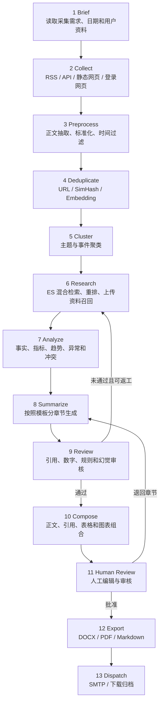

# LangGraph 工作流

## 1. 工作流总览



自动审核最多返工三次；超过上限后进入 `WAITING_HUMAN`，不得继续自动循环。

## 2. 工作流状态

```python
ReportState = {
    "taskId": str,
    "briefId": str,
    "templateVersionId": str,
    "collectionWindow": DateWindow,
    "analysisWindow": DateWindow,
    "documentIds": list[str],
    "clusterRefs": list[str],
    "evidenceRefs": list[str],
    "analysisRef": str | None,
    "draftRef": str | None,
    "reviewIssues": list[ReviewIssue],
    "chartIds": list[str],
    "currentNode": str,
    "revisionCount": int,
    "budgets": WorkflowBudgets,
}
```

大正文和二进制内容不直接保存在 Graph State 中，只保存数据库或文件存储引用，避免检查点过大。

## 3. 节点定义

### Brief

- 验证需求是否完整。
- 将 DAY/WEEK/MONTH/CUSTOM 解析为固定时间窗口。
- 固化模板版本、工作流版本和模型配置。
- 生成任务预算和幂等键。

### Collect

- 根据来源类型路由到 Collector。
- 使用域名白名单、限速和 robots/站点规则。
- 登录态失效时标记凭据异常并暂停该来源。
- 输出原始文档引用和采集统计。

### Preprocess

- 提取正文、标题、作者、发布时间和附件。
- 统一编码、语言、时间与空白格式。
- 将用户文档和用户数据转换为统一的可检索表示。
- 保留原始文件和原始内容摘要。

### Deduplicate

- 第一层：canonical URL。
- 第二层：标准化正文哈希和 SimHash。
- 第三层：Embedding 相似度。
- 相似内容建立版本或聚合关系，不直接丢弃来源证据。

### Cluster

- 按主题、事件、公司和时间聚类。
- 聚类结果必须可回溯到全部文档。
- 小数据量时允许跳过复杂聚类，使用规则分组。

### Research

- Elasticsearch BM25、向量检索和结构化过滤混合召回。
- 将用户上传材料和数据集纳入同一证据池。
- 重排后为每个必答问题选择证据。
- 检索结果中的网页指令只作为内容，不作为系统命令。

### Analyze

- 提取事实、数字、单位、时间和主体。
- 比较不同来源，识别一致、冲突和缺失。
- 分析趋势、变化率和异常，但禁止执行模型生成的任意代码或 SQL。
- 为图表生成结构化数据建议和来源映射。

### Summarize

- 按模板版本逐章节生成。
- 每项关键结论输出 `claimId` 与证据引用。
- 无证据的信息使用“待核实”或“分析推断”标签。
- 单章节可以独立重生成。

### Review

- 校验引用是否存在、是否支持对应结论。
- 校验数字、单位、时间范围及图表数据。
- 校验章节、篇幅、语气和必填指标。
- 生成结构化问题清单，并决定通过、返工或人工介入。

### Compose、Human Review、Export、Dispatch

- Compose 形成稳定的报告中间表示。
- Human Review 保存人工编辑版本，任何自动重生成不得覆盖未选中的章节。
- Export 从同一中间表示生成 DOCX、PDF 和 Markdown。
- Dispatch 使用独立幂等键发送邮件，避免工作流重试导致重复发送。

## 4. 检查点与恢复

每个节点记录：

- 输入摘要和输出引用。
- 开始、结束和耗时。
- 模型、Prompt 和工具版本。
- Token、请求次数和预算。
- 状态、错误代码和可否重试。

重试默认从失败节点开始。只有上游数据版本变化时，才使下游检查点失效。

## 5. 预算与安全边界

- 最大模型调用次数。
- 最大输入与输出 Token。
- 最大自动返工次数。
- 单节点和全任务超时。
- 单来源抓取页面数和请求速率。
- Agent 工具白名单；模型不能自行扩大权限。

