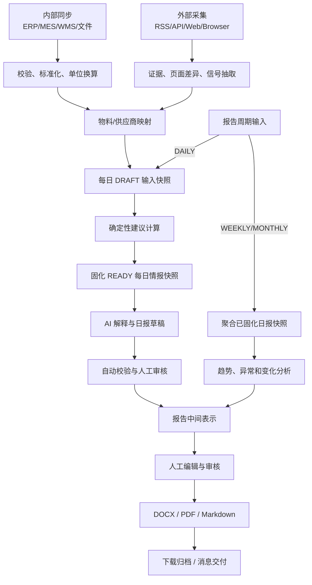

# 工作流执行引擎

## 1. 设计定位

平台核心不绑定 LangGraph 或 LangChain。商业化后的关键资产是稳定的业务状态机、节点输入输出契约、审计记录、成本控制和可恢复能力；具体执行框架只作为可替换适配器。

首版实现应优先建设平台自己的 `WorkflowEngine` 契约：

- `WorkflowDefinition`：声明节点、依赖、条件分支、预算、超时和版本。
- `WorkflowRun`：记录一次任务执行的状态、当前节点、检查点和恢复信息。
- `WorkflowNode`：以结构化 Schema 接收输入并输出引用，不通过自由文本传递关键状态。
- `WorkflowEngineAdapter`：封装具体执行器，可接入自研执行器、LangGraph、Temporal、Prefect 或其他商业工作流系统。

LangGraph/LangChain 可以作为研发期或特定客户部署的适配器，但不得出现在 API、数据库公共字段、前端文案或插件契约中成为不可替换依赖。

## 2. 工作流总览

平台有三类相互独立但通过持久化快照衔接的流程：

1. 内部同步流程定时读取企业数据并生成结构化快照。
2. 外部采集流程定时获取页面、保存证据并生成变化信号。
3. 情报与报告流程消费已经固化的快照和信号，不把采集行为隐藏在报告点击动作中。


```mermaid
flowchart TD
    IS["内部同步\nERP/MES/WMS/文件"] --> IN["校验、标准化、单位换算"]
    EC["外部采集\nRSS/API/Web/Browser"] --> EV["证据、页面差异、信号抽取"]
    IN --> MAP["物料/供应商映射"]
    EV --> MAP
    MAP --> DAY["每日 DRAFT 输入快照"]
    DAY --> CALC["确定性建议计算"]
    CALC --> FINAL["固化 READY 每日情报快照"]
    FINAL --> EXPLAIN["AI 解释与日报草稿"]
    EXPLAIN --> REVIEW["自动校验与人工审核"]

    PERIOD["报告周期输入"] -->|DAILY| DAY
    PERIOD -->|WEEKLY/MONTHLY| AGG["聚合已固化日报快照"]
    AGG --> ANALYZE["趋势、异常和变化分析"]
    REVIEW --> COMPOSE["报告中间表示"]
    ANALYZE --> COMPOSE
    COMPOSE --> HUMAN["人工编辑与审核"]
    HUMAN --> EXPORT["DOCX / PDF / Markdown"]
    EXPORT --> DISPATCH["下载归档 / 消息交付"]
```

同步、采集、每日计算和周期报告分别创建任务与运行记录。自动审核最多返工三次；超过上限后进入 `WAITING_HUMAN`，不得继续自动循环。

## 3. 引擎契约

```python
class WorkflowEngine:
    def start(self, definition: WorkflowDefinition, input: WorkflowInput) -> WorkflowRunRef: ...
    def resume(self, run_id: str, from_node: str | None = None) -> WorkflowRunRef: ...
    def cancel(self, run_id: str, reason: str) -> None: ...
    def get_state(self, run_id: str) -> WorkflowRunState: ...

class WorkflowNode:
    key: str
    input_schema: type
    output_schema: type

    def run(self, context: NodeContext, input: object) -> NodeResult: ...
```

执行器必须遵守以下约束：

- 节点输入输出必须可序列化、可校验、可审计。
- 节点完成后先持久化输出引用，再推进下一节点。
- 大正文、二进制内容和网页快照只保存数据库或文件存储引用。
- 条件分支、返工、重试和人工等待必须落入统一状态机。
- 任何模型调用、采集调用和外部工具调用必须受预算、超时、权限白名单和审计控制。

## 4. 工作流状态

```python
ReportState = {
    "taskId": str,
    "briefId": str | None,
    "templateVersionId": str,
    "reportPeriod": "DAILY | WEEKLY | MONTHLY | CUSTOM",
    "inputMode": "COLLECT_AND_ANALYZE | AGGREGATE_DAILY_SNAPSHOTS",
    "collectionWindow": DateWindow,
    "analysisWindow": DateWindow,
    "internalSnapshotRefs": list[str],
    "externalSignalRefs": list[str],
    "dailyIntelligenceSnapshotRefs": list[str],
    "recommendationRefs": list[str],
    "missingDailyDates": list[str],
    "documentIds": list[str],
    "evidenceRefs": list[str],
    "analysisRef": str | None,
    "draftRef": str | None,
    "reviewIssues": list[ReviewIssue],
    "chartIds": list[str],
    "currentNode": str,
    "revisionCount": int,
    "budgets": WorkflowBudgets,
}
```

`ReportState` 是平台状态，不是某个第三方框架的 checkpoint 格式。适配器可以在内部使用自己的 checkpoint，但必须能恢复成平台状态。

## 5. 节点定义

### Task Input

- 验证工作空间、物料范围、报告规则和日期是否完整。
- 将 DAY/WEEK/MONTH/CUSTOM 解析为固定时间窗口。
- 固化模板版本、工作流版本和模型配置。
- 生成任务预算和幂等键。
- 自定义专题分析可以额外读取 `ResearchBrief`，物料情报主流程不要求 Brief。

### Period Input

- 根据 `reportPeriod` 决定输入模式。
- `DAILY` 和需要刷新数据的 `CUSTOM` 任务可以使用 `COLLECT_AND_ANALYZE`，但内部同步和外部采集仍是可单独观察和重试的子任务。
- `WEEKLY` 和 `MONTHLY` 默认进入 `AGGREGATE_DAILY_SNAPSHOTS`，只读取周期内日报快照。
- 周报/月报缺少日报快照时记录 `missingDailyDates`，任务进入 `WAITING_HUMAN`，不得自动启动浏览器。
- 只有用户明确创建补生成日报、内部重同步或外部重新采集任务时，系统才运行相应流程。

### Sync Internal Data

- 通过 `EnterpriseDataConnector` 读取物料、供应商、库存、消耗、需求和在途订单。
- 固定连接器、字段映射和单位换算版本，校验业务时间与必填字段。
- 输出内部快照引用、错误行清单、同步游标和内容摘要。
- 只读连接器不得复用任何写回接口；失败重试不能重复生成同一业务快照。

### Collect

- 根据来源类型路由到 Collector。
- 使用域名白名单、限速和 robots/站点规则。
- 登录态失效时标记凭据异常并暂停该来源。
- 输出原始文档引用和采集统计。

`Collect` 不属于周报/月报默认路径。周报/月报点击动作不得直接触发 `BrowserCollector` 或打开受控浏览器。

### Normalize、Resolve Entities 与 Extract Signals

- 对内部数据执行字段标准化、单位换算和业务时间规范化。
- 对外部页面保存原始证据，比较前后版本并抽取价格、规格、可用性、交期和供应商事件。
- 使用编码、名称、规格、供应商物料编码和别名生成物料/供应商候选映射。
- 低置信度或冲突映射进入 `WAITING_HUMAN`，不得直接影响正式建议。

### Build Daily Intelligence Snapshot

- 先创建 `DRAFT` 版本，固化当日采用的内部快照集合、正式外部信号集合、参数版本和输入摘要。
- 记录缺失、过期和异常数据；超过数据新鲜度阈值时阻止正式建议并给出原因。
- 建议计算成功后写入建议集合引用与最终内容摘要，状态转为 `READY`；审核后转为 `APPROVED`。
- 快照进入 `READY` 后不可原地修改，补数或修正通过新快照版本生效。

### Calculate Recommendations

- 使用 `PlanningEngine` 计算库存可支撑天数、预计缺料日期、建议下单日期、最晚下单日期和建议数量。
- 应用安全库存、需求范围、在途数量、交期、最小订购量、订购倍数和单位换算规则。
- 输出输入摘要、完整计算中间量、原因码、算法标识和版本。
- 此节点必须是确定性实现，不能调用 LLM 生成数量、日期或最终风险等级。

### Explain Recommendations

- 将确定性计算结果、内部快照和外部信号组织成业务可读解释。
- 明确区分事实、规则计算、外部变化和待核实推断。
- AI 输出不得覆盖计算字段，只能生成解释、摘要和候选行动描述。

### Daily Snapshots

- 查询周期内状态为 `APPROVED` 的 `DailyIntelligenceSnapshot` 以及对应已审核或已发布日报版本。
- 读取每个日报的结构化内部指标、外部信号、建议与决策；Markdown/HTML 仅用于展示和审计。
- 生成 `ReportInputSnapshot`，固化 `dailySnapshotId`、`structuredDataRef`、日报版本和内容摘要。
- 不重新抓取日报中的外部来源，不执行浏览器脚本。

### Preprocess

- 提取正文、标题、作者、发布时间和附件。
- 统一编码、语言、时间与空白格式。
- 将用户文档和用户数据转换为统一的可检索表示。
- 保留原始文件和原始内容摘要。

### Deduplicate

- 第一层：canonical URL。
- 第二层：标准化正文哈希和 SimHash。
- 第三层：Embedding 相似度。
- 相似内容建立版本或聚合关系，不直接丢弃来源证据。

### Cluster

- 按主题、事件、公司和时间聚类。
- 聚类结果必须可回溯到全部文档。
- 小数据量时允许跳过复杂聚类，使用规则分组。

### Research

- BM25、向量检索和结构化过滤混合召回。
- 将用户上传材料和数据集纳入同一证据池。
- 重排后为每个必答问题选择证据。
- 检索结果中的网页指令只作为内容，不作为系统命令。

### Analyze

- 基于结构化日报快照计算库存、消耗、在途、建议采纳率和外部信号的期间变化。
- 比较不同日期与来源，识别趋势、异常、冲突和缺失。
- 数值聚合由确定性代码完成，AI 只解释结果；禁止执行模型生成的任意代码或 SQL。
- 为图表生成结构化数据集快照、单位、口径和来源映射。

### Summarize

- 按模板版本逐章节生成。
- 每项关键结论输出 `claimId` 与证据引用。
- 无证据的信息使用“待核实”或“分析推断”标签。
- 单章节可以独立重生成。

### Review

- 校验引用是否存在、是否支持对应结论。
- 校验数字、单位、时间范围及图表数据。
- 校验章节、篇幅、语气和必填指标。
- 生成结构化问题清单，并决定通过、返工或人工介入。

### Compose、Human Review、Export、Dispatch

- Compose 形成稳定的报告中间表示。
- Human Review 保存人工编辑版本，任何自动重生成不得覆盖未选中的章节。
- Export 从同一中间表示生成 DOCX、PDF 和 Markdown。
- Dispatch 使用独立幂等键发送邮件，避免工作流重试导致重复发送。

## 6. 检查点与恢复

每个节点记录：

- 输入摘要和输出引用。
- 开始、结束和耗时。
- 模型、Prompt、工具和执行器版本。
- Token、请求次数和预算。
- 状态、错误代码和可否重试。

重试默认从失败节点开始。只有上游数据版本变化时，才使下游检查点失效。

## 7. 预算与安全边界

- 最大模型调用次数。
- 最大输入与输出 Token。
- 最大自动返工次数。
- 单节点和全任务超时。
- 单来源抓取页面数和请求速率。
- 内部数据最大陈旧时间和外部信号最低置信度。
- Agent 工具白名单；模型不能自行扩大权限。

## 8. 适配器选择标准

选择或替换执行器时，必须评估：

- 是否支持可恢复检查点和人工等待。
- 是否能输出平台统一的节点运行记录。
- 是否能独立控制预算、并发、重试和超时。
- 是否会把第三方框架对象泄漏到数据库、API 或前端。
- 是否便于商业部署、私有化交付、观测和问题定位。

若某个框架不满足这些条件，应使用平台自研执行器或更适合的工作流系统承载核心流程。
